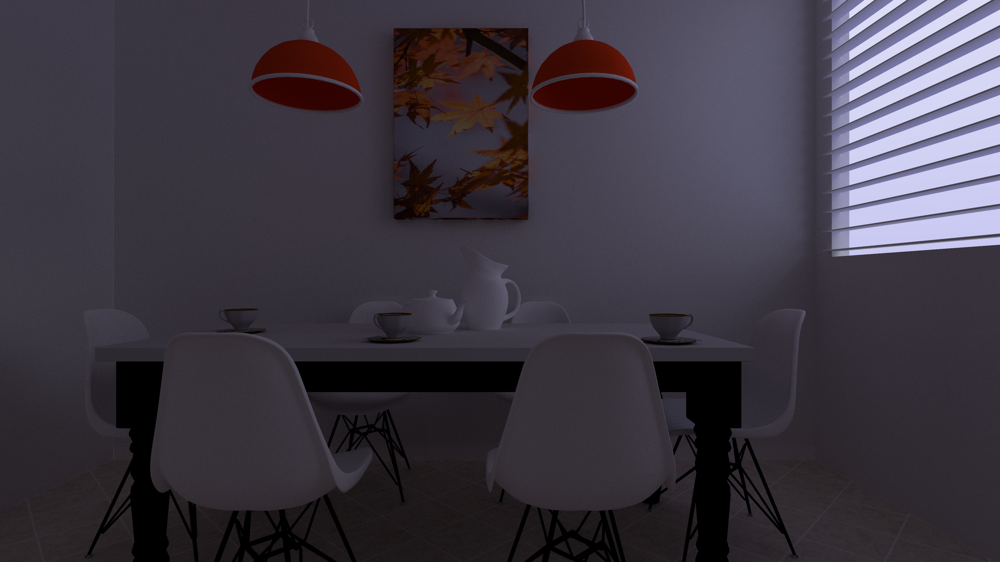
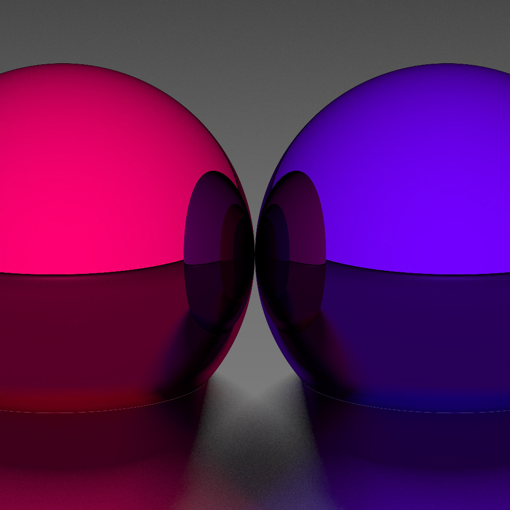
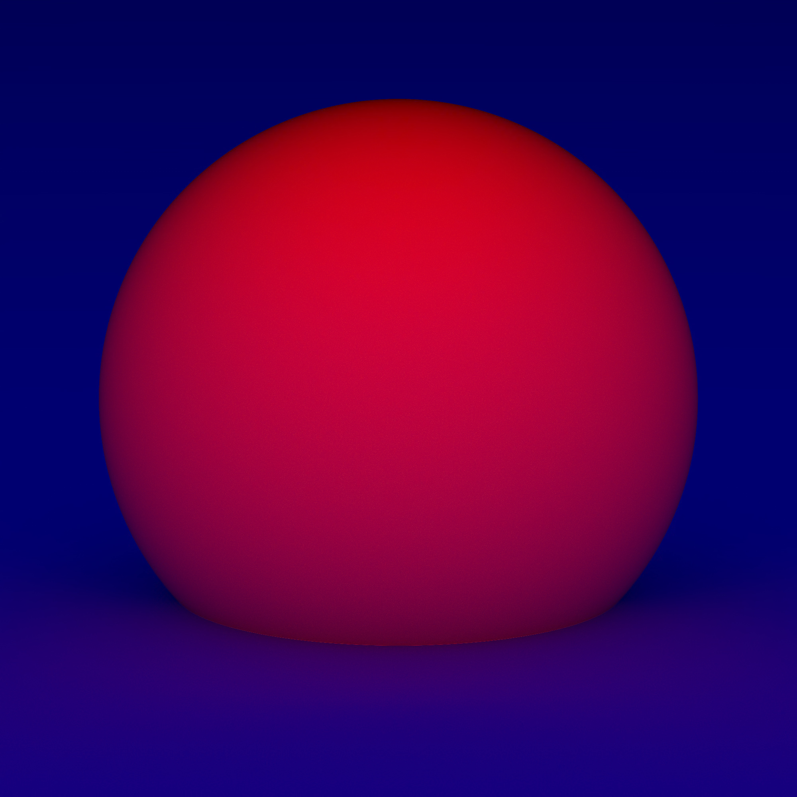

A zero-dependency raytracer, following first matklad's [raytracer-construction-kit](https://matklad.github.io/2022/12/31/raytracer-construction-kit.html) and now the [pbr book](https://www.pbr-book.org)

## Features
- Spheres, Planes & Triangles
- Obj file loading
 - Vertex normals for smooth surfaces
 - Diffuse Textures (in ppm format)
- Lambertain, Metal & Glass materials
- Custom scene description
- Bounding Volume Hierarchies
- Multithreading
- Memory mapped image

  -> Live preview

  -> Continue rendering

  -> Infinitely large images

## Usage
- if you dont want to pay the price for expensive normal calculations, remove all vn lines from the .obj file
## Images

